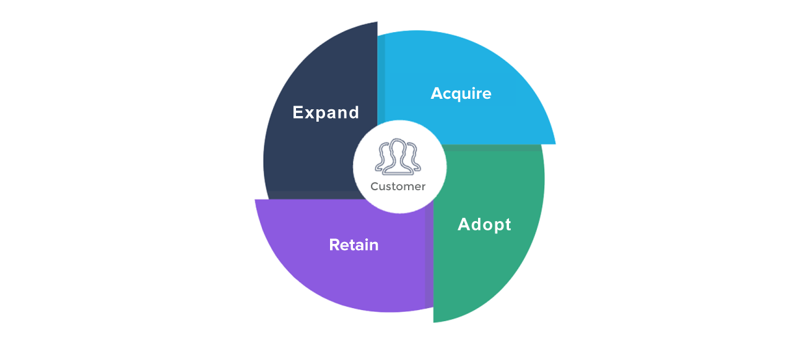
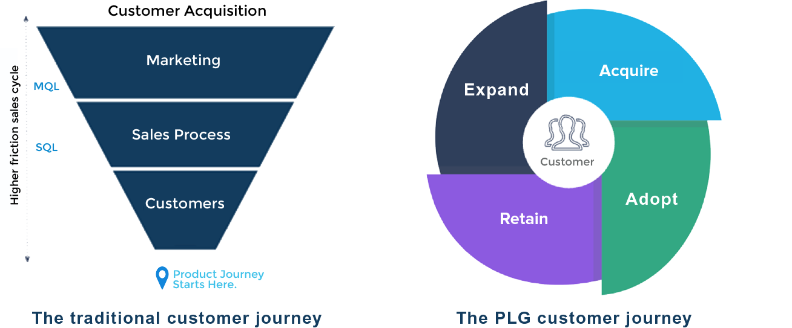
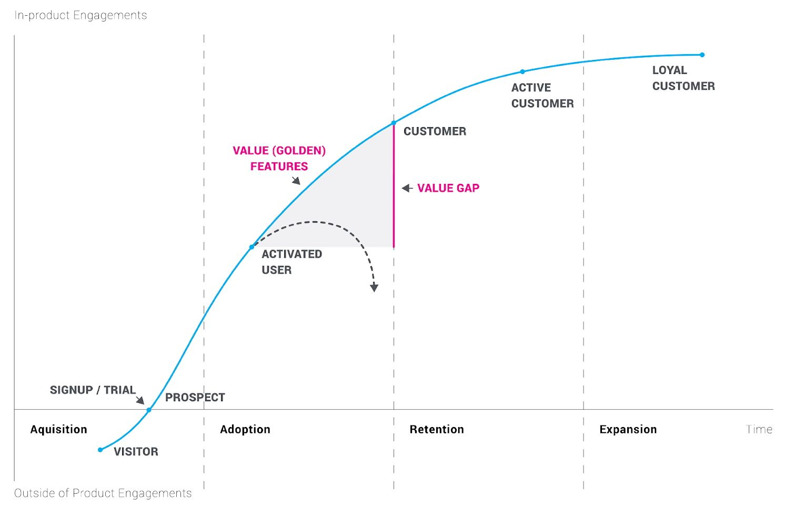
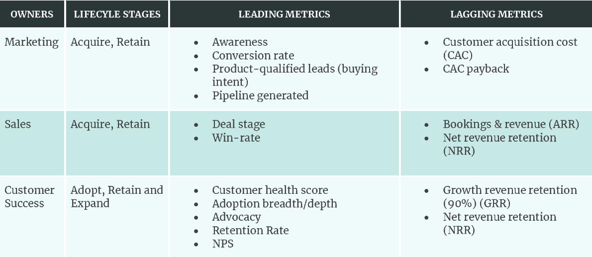
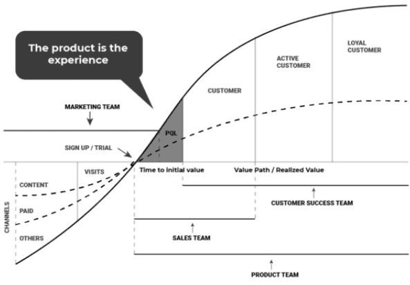
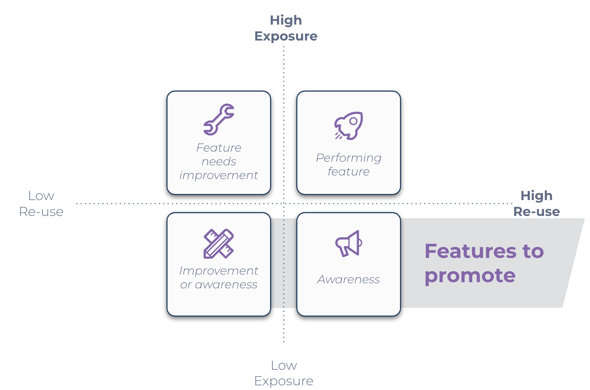
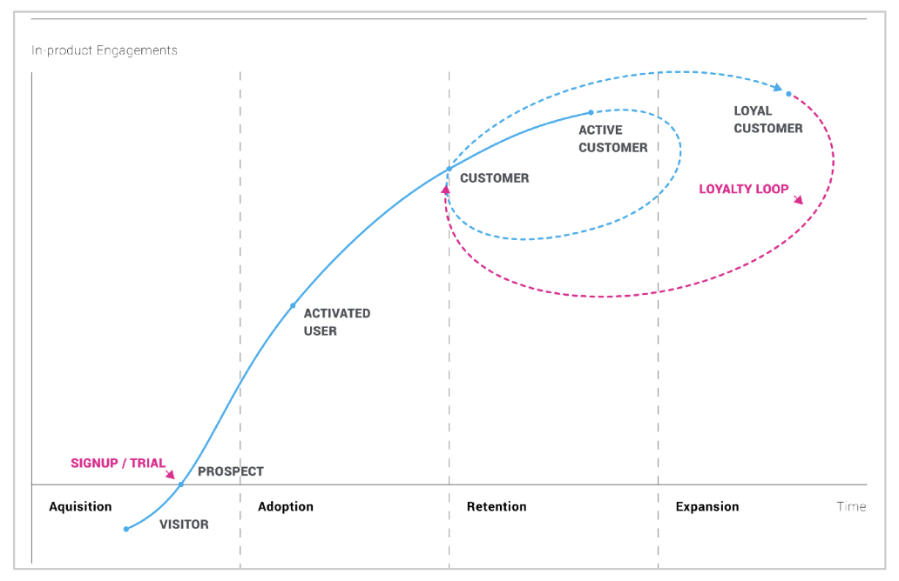
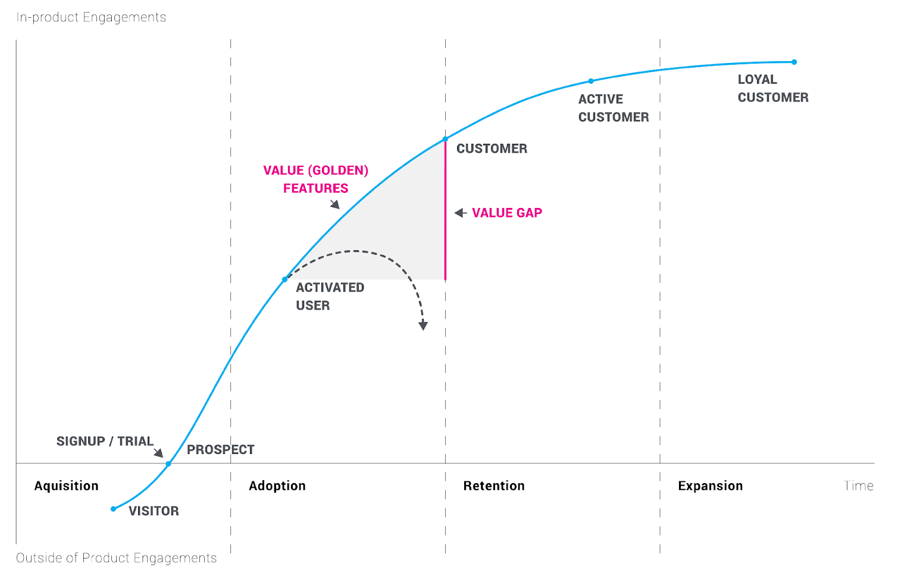

- [Visão Geral sobre Product-Led Growth (PLG)](#vis%C3%A3o-geral-sobre-product-led-growth-plg)
    - [O que é PLG?](#o-que-%C3%A9-plg)
    - [Quem impulsiona uma estratégia de PLG?](#quem-impulsiona-uma-estrat%C3%A9gia-de-plg)
    - [Por que o PLG é importante?](#por-que-o-plg-%C3%A9-importante)
    - [Por que o PLG é um movimento crescente?](#por-que-o-plg-%C3%A9-um-movimento-crescente)
- [Usando Seu Produto para Impulsionar a Jornada do Cliente](#usando-seu-produto-para-impulsionar-a-jornada-do-cliente)
    - [Estágios da Jornada do Cliente PLG](#est%C3%A1gios-da-jornada-do-cliente-plg)
    - [As Etapas do Flywheel do Cliente no PLG](#as-etapas-do-flywheel-do-cliente-no-plg)
        - [1\. Adquirir (Acquire)](#1-adquirir-acquire)
        - [2\. Adotar (Adopt)](#2-adotar-adopt)
        - [3\. Reter (Retain)](#3-reter-retain)
        - [4\. Expandir (Expand)](#4-expandir-expand)
- [4 PASSOS PARA IMPLEMENTAR UMA ESTRATÉGIA PLG](#4-passos-para-implementar-uma-estrat%C3%A9gia-plg)
    - [1\. DEFINA MÉTRICAS CHAVE PARA ACOMPANHAR](#1-defina-m%C3%A9tricas-chave-para-acompanhar)
    - [2\. FECHE A LACUNA DE VALOR](#2-feche-a-lacuna-de-valor)
    - [3\. MANTENHA OS USUÁRIOS ENGAJADOS](#3-mantenha-os-usu%C3%A1rios-engajados)
    - [4\. MEÇA, APRENDA E ITERE](#4-me%C3%A7a-aprenda-e-itere)
- [As métricas certas para medir](#as-m%C3%A9tricas-certas-para-medir)
    - [MÉTRICAS RETROSPECTIVAS (LAGGING METRICS)](#m%C3%A9tricas-retrospectivas-lagging-metrics)
    - [MÉTRICAS PROSPECTIVAS (LEADING METRICS)](#m%C3%A9tricas-prospectivas-leading-metrics)
        - [Algumas métricas comuns e seus departamentos](#algumas-m%C3%A9tricas-comuns-e-seus-departamentos)
- [Conquiste e converta clientes com a experiência de teste](#conquiste-e-converta-clientes-com-a-experi%C3%AAncia-de-teste)
    - [PRINCÍPIOS BÁSICOS (Freemium)](#princ%C3%ADpios-b%C3%A1sicos-freemium)
    - [ELEMENTOS ESSENCIAIS DE UMA AVALIAÇÃO GRATUITA](#elementos-essenciais-de-uma-avalia%C3%A7%C3%A3o-gratuita)
    - [COMO AS AVALIAÇÕES GRATUITAS SE ENCAIXAM NA AQUISIÇÃO DE CLIENTES](#como-as-avalia%C3%A7%C3%B5es-gratuitas-se-encaixam-na-aquisi%C3%A7%C3%A3o-de-clientes)
- [Guias de Integração Digital (Digital Onboarding Guides)](#guias-de-integra%C3%A7%C3%A3o-digital-digital-onboarding-guides)
    - [Importância fundamental no PLG e em Avaliações Gratuitas:](#import%C3%A2ncia-fundamental-no-plg-e-em-avalia%C3%A7%C3%B5es-gratuitas)
    - [Características e Componentes Comuns de um Bom Guia de Onboarding Digital:](#caracter%C3%ADsticas-e-componentes-comuns-de-um-bom-guia-de-onboarding-digital)
- [Tomando Decisões de Produto com Base em Dados (Data-Driven Product Decisions)](#tomando-decis%C3%B5es-de-produto-com-base-em-dados-data-driven-product-decisions)
    - [Por que é Fundamental?](#por-que-%C3%A9-fundamental)
    - [Tipos de Dados Utilizados:](#tipos-de-dados-utilizados)
    - [O Processo Cíclico de Tomada de Decisão Baseada em Dados:](#o-processo-c%C3%ADclico-de-tomada-de-decis%C3%A3o-baseada-em-dados)
        - [Ferramentas Comuns:](#ferramentas-comuns)
        - [Desafios:](#desafios)
    - [Conclusão:](#conclus%C3%A3o)
- [Estratégias da PLG para impulsionar a adoção e reter clientes](#estrat%C3%A9gias-da-plg-para-impulsionar-a-ado%C3%A7%C3%A3o-e-reter-clientes)
    - [Entendendo o NRR (Net Revenue Retention - Retenção Líquida de Receita)](#entendendo-o-nrr-net-revenue-retention-reten%C3%A7%C3%A3o-l%C3%ADquida-de-receita)
    - [Retenção: Da Abordagem Tradicional à Oportunidade com PLG](#reten%C3%A7%C3%A3o-da-abordagem-tradicional-%C3%A0-oportunidade-com-plg)
    - [O Desafio da Retenção na Face2Face](#o-desafio-da-reten%C3%A7%C3%A3o-na-face2face)
    - [Próximos Passos: Análise de Dados para Melhorar a Retenção](#pr%C3%B3ximos-passos-an%C3%A1lise-de-dados-para-melhorar-a-reten%C3%A7%C3%A3o)
- [Pesquisas com Usuários (User Surveys)](#pesquisas-com-usu%C3%A1rios-user-surveys)
    - [O que são?](#o-que-s%C3%A3o)
    - [Por que são Importantes?](#por-que-s%C3%A3o-importantes)
    - [Tipos Comuns de Pesquisas com Usuários:](#tipos-comuns-de-pesquisas-com-usu%C3%A1rios)
    - [Boas Práticas para Criar e Distribuir Pesquisas:](#boas-pr%C3%A1ticas-para-criar-e-distribuir-pesquisas)
    - [Desafios:](#desafios-2)
- [Métodos para Melhorar a Retenção](#m%C3%A9todos-para-melhorar-a-reten%C3%A7%C3%A3o)
    - [1\. Nutrindo Jornadas do Usuário Através de Engajamentos no Aplicativo](#1-nutrindo-jornadas-do-usu%C3%A1rio-atrav%C3%A9s-de-engajamentos-no-aplicativo)
    - [2\. Comunicando-se Proativamente com os Usuários](#2-comunicando-se-proativamente-com-os-usu%C3%A1rios)
    - [3\. Fornecendo Conhecimento de Autoatendimento Mais Aprofundado](#3-fornecendo-conhecimento-de-autoatendimento-mais-aprofundado)
    - [4\. Retenção de Longo Prazo - Alavancando Roadmaps](#4-reten%C3%A7%C3%A3o-de-longo-prazo-alavancando-roadmaps)
- [Priorizando o Plano de Retenção para Impulsionar a Receita](#priorizando-o-plano-de-reten%C3%A7%C3%A3o-para-impulsionar-a-receita)
- [Priorizando o Roteiro para o Crescimento - Maximizando o Valor do Tempo de Vida do Cliente (CLV)](#priorizando-o-roteiro-para-o-crescimento-maximizando-o-valor-do-tempo-de-vida-do-cliente-clv)
    - [Estratégia 1: Expandindo a receita de clientes existentes](#estrat%C3%A9gia-1-expandindo-a-receita-de-clientes-existentes)
    - [Estratégia 2: Capturando Novas Oportunidades de Receita](#estrat%C3%A9gia-2-capturando-novas-oportunidades-de-receita)
- [Criando um Roadmap Vencedor](#criando-um-roadmap-vencedor)
    - [Essenciais para Roadmaps Eficazes](#essenciais-para-roadmaps-eficazes)
    - [Equilíbrio é a Chave](#equil%C3%ADbrio-%C3%A9-a-chave)
- [Recap](#recap)
    - [Por que as Organizações Implementam PLG](#por-que-as-organiza%C3%A7%C3%B5es-implementam-plg)
        - [1\. PLG impulsiona o sucesso do negócio](#1-plg-impulsiona-o-sucesso-do-neg%C3%B3cio)
        - [2\. Estratégias de PLG ajudam sua organização a tomar decisões melhores e baseadas em dados](#2-estrat%C3%A9gias-de-plg-ajudam-sua-organiza%C3%A7%C3%A3o-a-tomar-decis%C3%B5es-melhores-e-baseadas-em-dados)
    - [O que uma Estratégia PLG Envolve](#o-que-uma-estrat%C3%A9gia-plg-envolve)

# Visão Geral sobre Product-Led Growth (PLG)

## O que é PLG?

Uma estratégia de go-to-market (GTM) que:

- coloca o produto na **vanguarda** da jornada do cliente
- utiliza o produto como um veículo chave para:
    - Adquirir
    - Converter
    - Reter
    - Expandir  
        (clientes)

PLG = evolução das estratégias de GTM lideradas por vendas ou marketing  
Capitaliza sobre a **consumerização** de produtos B2B ou B2C

* * *

## Quem impulsiona uma estratégia de PLG?

Gerentes de produto e líderes são tipicamente os impulsionadores por trás de uma estratégia de PLG, à medida que **o produto** se torna o principal veículo para impulsionar o crescimento e a retenção.

No entanto, uma estratégia de product-led growth bem-sucedida requer **alinhamento multifuncional e envolvimento** de toda a organização.

* * *

## Por que o PLG é importante?

Produtos são projetados para entregar resultados aos clientes. Eles são construídos para resolver desafios, fornecendo valor de volta ao cliente. Quando os produtos entregam valor, os clientes são mais propensos a adotar o produto – resultando em clientes felizes, uso contínuo e resultados bem-sucedidos e, em última análise, ROI positivo para o negócio.

Uma estratégia de product-led growth usa o produto para **melhorar as experiências do usuário e a adoção do produto**, levando a um ROI e métricas de negócio aprimorados.

Um PLG bem-sucedido alinha os produtos às necessidades de negócio dos usuários, impulsionando a adoção, renovações e expansão **através do próprio produto**. A experiência que seus clientes têm com seu produto moldará a percepção deles sobre sua organização, o valor que seu produto oferece e, por fim, influenciará o sucesso do seu produto e do seu negócio.

* * *

## Por que o PLG é um movimento crescente?

Pesquisas confirmam que, no espaço de software como serviço (SaaS), mais e mais organizações estão percebendo que uma estratégia de PLG as ajudará a escalar o crescimento. Organizações focadas em PLG:

Empresas como:

- Slack
- Zoom
- Calendly
- Dropbox
- Expensify

Estas empresas tiveram sucesso ao:

- Fornecer **valor imediato** de seus produtos através de contas de teste gratuito e onboarding instantâneo.
- Oferecer uma experiência fluida e **sem atritos**.
- **Iterar** nas funcionalidades do produto com base em dados de usuário reais e acionáveis, reduzindo pontos de atrito e destacando ferramentas que tornam seus produtos mais "pegajosos" (que retêm mais) e fáceis de usar.

* * *

&nbsp;

# Usando Seu Produto para Impulsionar a Jornada do Cliente

Você agora entende que em uma estratégia de product-led growth, o **produto** é o principal veículo por trás da jornada do cliente. Isso significa que o produto está **envolvido em cada estágio da jornada do cliente**, da aquisição à expansão, e essa jornada começa assim que um cliente se engaja com o produto. Frequentemente, isso é representado por um flywheel do cliente.  
  
O PLG difere da mentalidade de funil mais tradicional, onde o marketing engaja o cliente primeiro, depois vendas, e então o produto. Para ajudar a transmitir essa mudança, você deseja preparar um quiz cobrindo o framework de PLG para outros departamentos na Face2Face. Vamos testar o quiz que você elaborou!

## Estágios da Jornada do Cliente PLG

  
As jornadas do cliente no modelo tradicional têm sido mapeadas com mais uma **mentalidade de funil**. Nesse modelo, somente **depois** que um prospect se torna cliente é que o produto consegue influenciar as oportunidades de retenção e expansão.

Quando o flywheel é usado em vez disso, o próprio produto pode começar a acelerar a jornada do cliente para **reduzir o tempo para o valor do cliente**, **melhorar os esforços de retenção** e, por fim, **impulsionar mais receita**.

## As Etapas do Flywheel do Cliente no PLG

Cada estágio forma um ciclo contínuo, permitindo assim que o produto contribua continuamente para o crescimento.

### 1\. Adquirir (Acquire)

O estágio de **Adquirir** consiste em **trazer usuários para o seu produto**, frequentemente através de testes gratuitos ou experiências freemium. Isso pode ser simplesmente fazer com que os usuários se inscrevam e ativem sua conta de teste ou, sem um teste, ajudar os prospects a superar a barreira para se tornarem clientes pela primeira vez.

### 2\. Adotar (Adopt)

Durante a fase de **Adotar**, seu produto está direcionando usuários de teste ou prospects para completarem o onboarding (integração inicial) e se tornarem clientes pagantes de longo prazo. Isso significa **impulsionar a adoção efetiva** através de **funcionalidades que retêm (sticky features)** e **incentivar o uso regular**. Em resumo, converter usuários de visitantes casuais para clientes engajados ("fisgados").

### 3\. Reter (Retain)

Chegar à fase de **Reter** é quando seu produto incentiva os clientes a **renovar** sua assinatura ou pacote. Clientes retidos continuam a perceber valor do seu produto, reengajando-se se estiverem inativos, e têm uma experiência do usuário fácil e fluida, em vez de uma difícil ou complexa.

### 4\. Expandir (Expand)

A última fase, **Expandir**, coloca seu **produto no centro da sua estratégia de crescimento de receita**, seja incentivando os usuários a fazer **upgrade** dos pacotes de assinatura para um nível superior, interagir com funcionalidades pagas (paywall), ou de outra forma **gerar receita adicional**.

* * *

&nbsp;

# 4 PASSOS PARA IMPLEMENTAR UMA ESTRATÉGIA PLG

## 1\. DEFINA MÉTRICAS CHAVE PARA ACOMPANHAR

> Antes de fazer alterações ou investimentos em seu produto, você deve primeiro entender quais métricas de negócios, ou indicadores-chave de desempenho (KPIs), sua organização deseja melhorar e como as métricas do seu produto podem impulsionar essas melhorias. Isso significa:
> 
> - Definir quais métricas você deseja acompanhar
> - Decidir em quais áreas você se concentrará para melhorar essa métrica
> - Determinar como você acompanhará cada métrica  
>     Aprofundaremos nessas métricas mais tarde.

## 2\. FECHE A LACUNA DE VALOR

> Depois de saber quais métricas você deseja medir, poderá ver onde os usuários estão agindo conforme o planejado – e onde não estão obtendo o valor total do seu produto. Você precisará implementar estratégias para fechar essa lacuna de valor para os usuários.  
> A lacuna de valor é a diferença entre o valor percebido que um usuário tem do seu produto e o que seu produto pode realmente entregar.  
> Uma lacuna de valor significa que os usuários não entendem completamente o que seu produto pode ajudá-los a alcançar e, para ativar e reter usuários, você precisa fechar essa lacuna.  
> 

## 3\. MANTENHA OS USUÁRIOS ENGAJADOS

> Depois que os usuários percebem o valor do seu produto, a retenção bem-sucedida depende de manter os usuários engajados e investidos em seu produto.  
> Isso significa fornecer conteúdo contextual e relevante aos usuários para promover valor adicional e contínuo.  
> É mais facilmente alcançado por meio de engajamentos no aplicativo que se conectam com seus clientes da maneira mais fácil possível – diretamente em seu produto.

## 4\. MEÇA, APRENDA E ITERE

> Embora as comunicações no aplicativo sejam fundamentais para manter os usuários engajados, elas são apenas uma solução de curto prazo para o atrito nas experiências do usuário. Estratégias de PLG bem-sucedidas devem influenciar seu roteiro de produto de longo prazo com base em dados e feedback do usuário, e fazê-lo construindo sobre os programas implementados ao longo de sua jornada de PLG.  
> A iteração contínua é fundamental para a expansão, assim como ajustar suas estratégias no aplicativo para melhor engajar com as necessidades em constante mudança dos usuários.

* * *

&nbsp;

# As métricas certas para medir

## MÉTRICAS RETROSPECTIVAS (LAGGING METRICS)

> MÉTRICAS RETROSPECTIVAS (LAGGING METRICS) só podem ser calculadas após a ocorrência de um evento, o que significa que você precisa coletar dados sobre eventos passados para determinar o valor da métrica. Isso significa que elas estão 'atrasadas' em relação aos eventos atuais.
> 
> Por exemplo, a retenção líquida de receita (NRR), que mede a porcentagem da receita recorrente retida de clientes existentes durante um determinado período, é retrospectiva. Para calcular esse valor, você deve primeiro completar um ciclo de qualquer período que deseje medir.

## MÉTRICAS PROSPECTIVAS (LEADING METRICS)

> MÉTRICAS PROSPECTIVAS (LEADING METRICS) ajudam a prever o estado futuro de algo, antes que aconteça.
> 
> Por exemplo, se você observar baixas taxas de adoção de recursos importantes ou baixa retenção de usuários (atividade diária e mensal entre os usuários), isso pode indicar que um cliente vai cancelar (churn). Indicadores prospectivos ajudam a identificar e resolver problemas antes que ocorram, oferecendo a oportunidade de abordar medidas como uso ou adoção antes que um cliente chegue à renovação.

### Algumas métricas comuns e seus departamentos

* * *

&nbsp;

# Conquiste e converta clientes com a experiência de teste

## PRINCÍPIOS BÁSICOS (Freemium)

Uma avaliação gratuita:

- É uma forma eficaz para os usuários começarem e **rapidamente perceberem valor** (frequentemente, o tempo necessário para começar a obter valor de um produto é chamado de time-to-value – TTV)
- **Apresenta os benefícios do seu produto** sem exigir ações complexas por parte do usuário.
- Permite que os usuários se integrem (onboard) mesmo antes de serem clientes pagantes, tornando seu produto **parte de seus fluxos de trabalho normais** e ‘aderente’ (sticky) às suas necessidades.

> Observação: um mito comum que frequentemente surge com a estratégia PLG é que ela utiliza apenas um método de aquisição de avaliação gratuita ou freemium. As avaliações gratuitas são, de fato, uma estratégia PLG comum porque permitem que você aproveite o produto como veículo para atração e engajamento do cliente. Isso vai ao encontro do objetivo do PLG, conduzindo as jornadas do cliente por meio do seu produto. No entanto, um modelo de avaliação gratuita/freemium é apenas o primeiro passo de uma estratégia PLG eficaz.

A observação acima é crucial, pois o Product-Led Growth (PLG) vai além de simplesmente oferecer um teste gratuito ou um plano freemium. Embora esses sejam pontos de partida valiosos e comuns, uma estratégia PLG abrangente pode incorporar diversas outras táticas onde o produto em si é o principal motor de aquisição, retenção e expansão. Algumas dessas abordagens incluem:

- **Demonstrações Interativas ou Ambientes de Teste (Sandbox):** Em vez de um acesso completo, algumas empresas oferecem a possibilidade de interagir com o produto em um ambiente controlado, muitas vezes com dados de exemplo e cenários guiados. Isso permite que o usuário experimente o "momento aha!" rapidamente, sem a necessidade de configurar uma conta completa ou integrar seus próprios dados inicialmente. É especialmente útil para produtos mais complexos.
- **Modelos Gratuitos Baseados em Uso (Variantes do Freemium):** Além do freemium tradicional (que oferece um conjunto limitado de funcionalidades gratuitamente para sempre), existem modelos onde o uso gratuito é limitado por volume (ex: X contatos, Y projetos, Z GB de armazenamento). Ao atingir o limite, o usuário percebe o valor e é incentivado a fazer o upgrade. Isso alinha o custo ao valor que o usuário extrai.
- **Tours Guiados e Experiências de Integração (Onboarding) Contextuais:** Muitas estratégias PLG focam em criar uma experiência de onboarding impecável que guia o usuário pelas funcionalidades chave do produto, ajudando-o a realizar uma primeira tarefa de valor rapidamente. Isso pode ser mais eficaz do que simplesmente liberar todas as funcionalidades de uma vez.
- **Modelo "Reverse Trial" (Teste Reverso) ou Teste de Funcionalidades Premium:** Neste modelo, o novo usuário pode ter acesso a todas as funcionalidades premium por um período limitado. Se não fizer o upgrade, ele é automaticamente revertido para um plano gratuito ou mais básico, mas já teve a chance de vivenciar o potencial máximo da ferramenta, o que pode incentivar a conversão futura.
- **Conteúdo Desbloqueável ou Funcionalidades Progressivas:** O usuário começa com um conjunto básico de ferramentas e, à medida que usa o produto e atinge certos marcos, novas funcionalidades ou conteúdos são desbloqueados. Isso cria uma jornada de descoberta e engajamento contínuos.

Todas essas abordagens compartilham o cerne do PLG: utilizar o próprio produto como a principal ferramenta para atrair, engajar e converter clientes, permitindo que eles experimentem e reconheçam o valor diretamente, muitas vezes antes mesmo de qualquer interação com uma equipe de vendas.

## ELEMENTOS ESSENCIAIS DE UMA AVALIAÇÃO GRATUITA

Qualquer avaliação gratuita deve:

- Reduzir o atrito nas inscrições dos usuários (como **nenhuma informação de pagamento** exigida)
- Apresentar um **guia de integração (onboarding)** digital, começando no primeiro dia, demonstrando as funcionalidades centrais e básicas do produto para levar os usuários rapidamente ao seu primeiro momento de valor
- Normalmente, permitir que os usuários **acessem todas as áreas** do produto, tornando o produto o mais aderente (sticky) possível, o mais rápido possível (isso pode variar um pouco dependendo do tipo de produto e da indústria)
- **Dar aos usuários tempo suficiente para implantar o produto** (geralmente 30 dias completos dentro da avaliação) antes de exigir que se tornem clientes pagantes

## COMO AS AVALIAÇÕES GRATUITAS SE ENCAIXAM NA AQUISIÇÃO DE CLIENTES

As avaliações gratuitas melhoram as taxas de conversão ao:

- **Gerar conscientização sobre seu produto**. Entre os esforços da equipe de marketing e o boca a boca baseado nos usuários em teste (trialists), os clientes tomam conhecimento do produto.
- **Apresentar valor usando o próprio produto** para despertar o interesse dos prospects, engajá-los e prepará-los para a compra por meio de uma avaliação gratuita.
- Medir o interesse e melhorar o foco de vendas usando **leads qualificados pelo produto (PQLs)**. PQLs são leads que se ‘qualificam’ para a abordagem de vendas ao demonstrar intenção de compra. Usar PQLs reduz o fardo sobre o marketing ou vendas para impulsionar os prospects sozinhos e torna seu produto parte da experiência para converter leads em clientes.

> O produto trabalha com todas as equipes para engajar os usuários ao longo de sua jornada, onde uma avaliação gratuita entra em jogo.  
> 

* * *

&nbsp;

# Guias de Integração Digital (Digital Onboarding Guides)

Os **guias de integração digital** são um conjunto de processos e ferramentas interativas dentro de um produto digital (software, aplicativo, plataforma online) projetados para dar as boas-vindas, educar e orientar os novos usuários. O objetivo principal é ajudá-los a entender rapidamente o valor do produto, aprender suas funcionalidades essenciais e começar a usá-lo de forma eficaz para atingir seus objetivos o mais rápido possível.

Pense neles como um "mentor digital" que acompanha o usuário nos seus primeiros passos.

## **Importância fundamental no PLG e em Avaliações Gratuitas:**

No modelo PLG, o produto é o principal motor de aquisição, ativação e retenção. Se um usuário entra em um "free trial" e não consegue entender como usar o produto ou não percebe seu valor rapidamente, a chance de ele abandonar a ferramenta é altíssima. É aqui que o guia de onboarding digital se torna vital:

1.  **Redução do Time-to-Value (TTV):** Acelera o momento em que o usuário experimenta o primeiro "aha moment" – aquele instante de clareza em que ele percebe o benefício principal do produto para sua necessidade.
2.  **Aumento da Ativação de Usuários:** Garante que os usuários não apenas se cadastrem, mas efetivamente comecem a usar as funcionalidades chave.
3.  **Melhora da Retenção Inicial:** Usuários que entendem e obtêm valor rapidamente têm maior probabilidade de continuar usando o produto após o período de teste.
4.  **Diminuição da Carga sobre o Suporte:** Um bom onboarding responde proativamente às dúvidas iniciais mais comuns, reduzindo a necessidade de contato com a equipe de suporte.
5.  **Destaque de Funcionalidades Chave:** Direciona a atenção do usuário para as funcionalidades que melhor demonstram o valor do produto e resolvem seus principais problemas.

## **Características e Componentes Comuns de um Bom Guia de Onboarding Digital:**

- **Boas-vindas Personalizadas:** Uma mensagem inicial que pode incluir o nome do usuário e talvez perguntar sobre seus objetivos para personalizar a experiência.
- **Tours Guiados (Product Tours):** Sequências passo a passo que destacam elementos da interface e explicam funcionalidades importantes. Podem ser lineares ou contextuais (acionados quando o usuário acessa uma nova área).
- **Tooltips (Dicas de Ferramenta):** Pequenas janelas de informação que aparecem quando o usuário passa o mouse ou clica em um elemento específico da interface.
- **Checklists de Configuração/Primeiros Passos:** Listas de tarefas que guiam o usuário através das ações iniciais mais importantes para configurar sua conta ou realizar uma primeira tarefa de valor. Marcar itens como concluídos dá uma sensação de progresso.
- **Modais e Pop-ups Informativos:** Usados com moderação para fornecer informações cruciais ou destacar uma funcionalidade importante no momento certo.
- **Vídeos Curtos e GIFs Animados:** Para demonstrar visualmente como realizar certas ações ou explicar conceitos.
- **Barra de Progresso:** Mostra ao usuário o quão perto ele está de completar o onboarding, incentivando-o a continuar.
- **Conteúdo de Ajuda Integrado:** Links fáceis para FAQs, documentação ou chat de suporte, caso o usuário precise de mais informações.
- **Gamificação (Opcional):** Elementos como emblemas ou pontos por completar etapas do onboarding podem aumentar o engajamento para alguns públicos.
- **Segmentação:** Idealmente, o onboarding pode ser adaptado com base no tipo de usuário, seu nível de experiência ou os objetivos que ele deseja alcançar com o produto.

Um guia de onboarding digital eficaz não é apenas um tutorial passivo; é uma experiência interativa, focada na ação e desenhada para levar o usuário ao sucesso o mais rápido possível. Ele é a primeira grande oportunidade de causar uma excelente impressão e demonstrar o valor intrínseco do produto, sendo um pilar para o sucesso de qualquer estratégia PLG.

* * *

&nbsp;

# Tomando Decisões de Produto com Base em Dados (Data-Driven Product Decisions)

**O que é?**

Tomar decisões de produto com base em dados significa utilizar informações concretas e mensuráveis – em vez de apenas intuição, opiniões pessoais ou suposições – para guiar o desenvolvimento, aprimoramento e estratégia de um produto. Trata-se de um processo sistemático de coletar, analisar e interpretar dados para entender o comportamento dos usuários, identificar oportunidades, validar hipóteses, medir o impacto de mudanças e, em última instância, construir produtos melhores que atendam às necessidades reais dos clientes e aos objetivos do negócio.

## **Por que é Fundamental?**

1.  **Redução de Riscos:** Decisões baseadas em evidências diminuem a probabilidade de investir tempo e recursos em funcionalidades ou direções que não trarão o retorno esperado.
2.  **Foco no Usuário:** Os dados revelam como os usuários realmente interagem com o produto, quais são seus pontos de dor, suas preferências e onde encontram valor. Isso permite criar soluções mais centradas neles.
3.  **Otimização Contínua:** Permite identificar gargalos, áreas de baixo engajamento ou alto abandono, direcionando esforços para melhorias contínuas (como vimos na importância do onboarding).
4.  **Validação de Hipóteses:** Em vez de debater opiniões, as equipes podem formular hipóteses e testá-las com dados (ex: Testes A/B), chegando a conclusões mais objetivas.
5.  **Alinhamento Estratégico:** Dados claros e compartilhados ajudam a alinhar as equipes de produto, engenharia, marketing e vendas em torno de objetivos comuns e de uma compreensão compartilhada do desempenho do produto.
6.  **Previsibilidade e Projeção:** Embora não seja uma bola de cristal, a análise de tendências históricas e atuais pode ajudar a prever comportamentos futuros e a planejar com mais segurança.
7.  **Maximização do ROI:** Ao focar em iniciativas que comprovadamente geram impacto positivo nas métricas chave, otimiza-se o retorno sobre o investimento.

## **Tipos de Dados Utilizados:**

A tomada de decisão eficaz geralmente combina diferentes tipos de dados:

- **Dados Quantitativos (O quê? Quanto?):**
    - **Métricas de Produto/Engajamento:** Usuários ativos diários/mensais (DAU/MAU), tempo de sessão, taxa de adoção de funcionalidades, funis de conversão (ex: do cadastro à primeira ação de valor), taxas de retenção e churn.
    - **Métricas de Negócio:** Receita (ARR/MRR), Custo de Aquisição de Cliente (CAC), Valor do Tempo de Vida do Cliente (LTV), taxa de conversão de trial para pago.
    - **Resultados de Testes A/B:** Comparações estatísticas do desempenho de diferentes versões de uma funcionalidade ou interface.
    - **Dados de Performance Técnica:** Tempo de carregamento, taxas de erro, uso de infraestrutura.
- **Dados Qualitativos (Por quê? Como?):**
    - **Feedback Direto do Usuário:** Pesquisas de satisfação (NPS, CSAT), entrevistas com usuários, e-mails de suporte, reviews em lojas de aplicativos, comentários em redes sociais.
    - **Testes de Usabilidade:** Observação direta de usuários tentando realizar tarefas no produto para identificar dificuldades e frustrações.
    - **Mapas de Calor (Heatmaps) e Gravações de Sessão:** Visualizam onde os usuários clicam, movem o mouse e como navegam pelas páginas.
    - **Análise de Sentimento:** Processamento de linguagem natural para entender o tom (positivo, negativo, neutro) do feedback textual.

## **O Processo Cíclico de Tomada de Decisão Baseada em Dados:**

Não é um evento único, mas um ciclo contínuo:

1.  **Definir Objetivos e Perguntas Chave:** Qual problema queremos resolver? Que oportunidade queremos explorar? Qual é a nossa "North Star Metric" (métrica principal que melhor captura o valor entregue aos usuários)?
2.  **Identificar Métricas Relevantes (KPIs):** Quais indicadores nos dirão se estamos no caminho certo? (Lembrando dos Leading e Lagging indicators).
3.  **Coletar Dados:** Implementar ferramentas de analytics, configurar rastreamento de eventos, coletar feedback. Garantir a qualidade e integridade dos dados é crucial.
4.  **Analisar e Interpretar:** Transformar dados brutos em insights acionáveis. Isso envolve segmentar dados (por tipo de usuário, comportamento, etc.), procurar padrões, tendências, correlações e, idealmente, causalidades.
5.  **Formular Hipóteses:** Com base nos insights, criar suposições testáveis sobre como melhorar o produto (ex: "Se simplificarmos o fluxo X, aumentaremos a taxa de conclusão em Y%").
6.  **Experimentar e Testar:** Rodar testes A/B, lançar MVPs (Minimum Viable Products) para funcionalidades novas, ou fazer lançamentos graduais (canary releases).
7.  **Decidir e Implementar:** Com base nos resultados dos testes, tomar a decisão de implementar a mudança, ajustá-la ou abandoná-la.
8.  **Medir Resultados e Iterar:** Após a implementação, monitorar o impacto nas métricas chave. O aprendizado de cada ciclo alimenta o próximo.

### **Ferramentas Comuns:**

- Plataformas de Product Analytics (ex: Amplitude, Mixpanel, Google Analytics 4)
- Ferramentas de Teste A/B (ex: Optimizely, VWO, Google Optimize)
- Ferramentas de Feedback e Pesquisa (ex: Hotjar, SurveyMonkey, Typeform)
- Plataformas de Business Intelligence (BI) (ex: Tableau, Power BI)
- Ferramentas de Gerenciamento de Suporte ao Cliente (ex: Zendesk, Intercom)

### **Desafios:**

- **Qualidade dos Dados:** Dados imprecisos ou incompletos levam a conclusões erradas.
- **Volume de Dados (Data Overload):** Saber o que é relevante e não se perder em um mar de números.
- **Viés de Análise:** Interpretar dados de forma a confirmar crenças preexistentes.
- **Correlação vs. Causalidade:** Entender que duas coisas acontecerem juntas não significa que uma causou a outra.
- **Falta de Habilidades Analíticas:** A equipe precisa saber como interpretar os dados corretamente.
- **Equilíbrio com a Visão e Intuição:** Os dados são um guia poderoso, mas a visão estratégica de longo prazo e a intuição experiente ainda têm seu lugar, especialmente para inovações disruptivas onde não há dados históricos.

## **Conclusão:**

Adotar uma cultura orientada a dados é transformar a maneira como os produtos são concebidos e evoluem. Permite que as equipes de produto se movam com mais confiança, agilidade e foco no que realmente importa para os usuários e para o negócio. É um investimento em inteligência que se traduz em produtos mais bem-sucedidos e clientes mais satisfeitos.

* * *

&nbsp;

# Estratégias da PLG para impulsionar a adoção e reter clientes

**NRR e Retenção de Clientes**

## Entendendo o NRR (Net Revenue Retention - Retenção Líquida de Receita)

NRR é a porcentagem da receita recorrente retida de clientes existentes em um período definido, incluindo nova receita de expansão, downgrades (reduções de plano) e cancelamentos. Melhorar o NRR é fundamental para o crescimento do negócio, com dados mostrando que um aumento de 5% na retenção de clientes pode levar a um aumento nos lucros de 25-95% (Bain & Company).

Você pode calcular o NRR usando a seguinte fórmula:

> (Receita Total (incluindo expansão) - Churn (cancelamentos ou downgrades)) / Receita Total (do início do período)

## Retenção: Da Abordagem Tradicional à Oportunidade com PLG

Quando você ouve "retenção", o sucesso do cliente (customer success) provavelmente vem à mente. Os departamentos de sucesso do cliente têm sido tradicionalmente responsáveis por impulsionar a retenção, já que as renovações dependiam historicamente do nível de serviço que sua equipe de sucesso do cliente e suporte poderia fornecer.

Com a abordagem PLG (Product-Led Growth), há uma oportunidade de apoiar e influenciar a retenção construindo melhores experiências de produto focadas no valor de longo prazo para os usuários.

## O Desafio da Retenção na Face2Face

Você percebe que a maioria dos usuários da Face2Face usa o produto regularmente no início, mas há uma queda significativa no uso ao longo do tempo.

Você descobriu que **30% dos usuários deixam o produto antes da primeira renovação**. Sabemos que muitos usuários obtêm valor inicial, já que nossa taxa de adoção permanece forte, mas o valor de longo prazo parece não ser percebido por alguns. Agora é nossa responsabilidade resolver este problema e melhorar nossas métricas de retenção.

## Próximos Passos: Análise de Dados para Melhorar a Retenção

Precisamos mergulhar novamente em nossos dados para analisar onde e como os usuários estão abandonando o produto. Isso nos ajudará a determinar quais funcionalidades impulsionam a retenção, a satisfação e o crescimento, e onde precisamos concentrar os esforços de PLG.

* * *

&nbsp;

# Pesquisas com Usuários (User Surveys)

## **O que são?**

Pesquisas com usuários são um método de coleta de dados que envolve fazer um conjunto estruturado de perguntas diretamente aos seus usuários (ou a um segmento deles). O objetivo é obter feedback, opiniões, preferências, níveis de satisfação e insights sobre suas experiências, necessidades e comportamentos em relação ao seu produto ou serviço. Elas podem variar de perguntas rápidas de múltipla escolha a questões abertas que permitem respostas mais detalhadas.

## **Por que são Importantes?**

No contexto de Product-Led Growth (PLG) e na busca por melhorar métricas como NRR e retenção, as pesquisas com usuários oferecem o "porquê" por trás dos "oquês" que os dados de analytics muitas vezes revelam.

1.  **Entender a Experiência do Usuário:** Permitem medir a satisfação (CSAT), a lealdade (NPS), o esforço percebido (CES) e identificar pontos de atrito ou delight na jornada do cliente.
2.  **Coletar Feedback Direto sobre Funcionalidades:** Descobrir quais funcionalidades são mais valorizadas, quais estão faltando, quais são confusas ou difíceis de usar.
3.  **Identificar Motivos de Churn:** Pesquisas com usuários que cancelaram ou fizeram downgrade podem revelar as razões por trás dessas decisões, oferecendo insights cruciais para melhorias.
4.  **Validar Hipóteses e Ideias:** Antes de investir no desenvolvimento de uma nova funcionalidade, uma pesquisa pode ajudar a medir o interesse e a relevância para o público-alvo.
5.  **Segmentar Usuários e Entender Personas:** Coletar dados demográficos (com consentimento) ou sobre casos de uso específicos pode ajudar a refinar personas e a personalizar a experiência.
6.  **Priorizar o Roadmap:** O feedback coletado pode ser um input valioso para decidir quais melhorias ou novas funcionalidades devem ser priorizadas.
7.  **Medir o Sucesso de Mudanças:** Realizar pesquisas antes e depois de uma atualização do produto pode ajudar a medir o impacto percebido pelos usuários.
8.  **Dar Voz ao Usuário:** Demonstra que a empresa se importa com a opinião dos seus clientes, o que pode fortalecer o relacionamento.

## **Tipos Comuns de Pesquisas com Usuários:**

- **Net Promoter Score (NPS):** Pergunta "Em uma escala de 0 a 10, o quão provável você é de recomendar nosso produto/serviço a um amigo ou colega?". Classifica os usuários em Promotores, Neutros e Detratores.
- **Customer Satisfaction (CSAT):** Mede a satisfação com uma interação específica, produto ou funcionalidade. Ex: "Em uma escala de 1 a 5, quão satisfeito você ficou com \[funcionalidade X\]?".
- **Customer Effort Score (CES):** Mede a facilidade com que um usuário conseguiu realizar uma tarefa. Ex: "Quão fácil foi para você completar \[tarefa X\]?".
- **Pesquisas de Onboarding:** Enviadas após o usuário completar o processo inicial para avaliar a clareza e eficácia do onboarding.
- **Pesquisas de Churn/Cancelamento:** Para entender os motivos pelos quais os usuários estão deixando o produto.
- **Pesquisas de Feedback de Produto:** Focadas em coletar opiniões sobre funcionalidades existentes ou desejadas.
- **Pesquisas de Teste de Conceito:** Para avaliar o interesse em novas ideias ou funcionalidades antes do desenvolvimento.
- **Pesquisas de Usabilidade (ex: System Usability Scale - SUS):** Questionários padronizados para medir a percepção de usabilidade do produto.

## **Boas Práticas para Criar e Distribuir Pesquisas:**

1.  **Defina Objetivos Claros:** Saiba exatamente o que você quer aprender com a pesquisa. Isso guiará a criação das perguntas.
2.  **Mantenha a Pesquisa Curta e Focada:** Respeite o tempo do usuário. Pesquisas longas têm taxas de resposta menores.
3.  **Faça Perguntas Claras e Imparciais:** Evite jargões, ambiguidades ou perguntas tendenciosas que possam influenciar a resposta.
4.  **Use uma Mistura de Tipos de Perguntas:**
    - **Fechadas:** Escalas (Likert, 1-5, 1-10), múltipla escolha, sim/não. Fáceis de analisar quantitativamente.
    - **Abertas:** Permitem respostas textuais livres, ricas em insights qualitativos, mas mais demoradas para analisar. Use com moderação.
5.  **Crie um Fluxo Lógico:** Organize as perguntas de forma intuitiva.
6.  **Segmente seu Público:** Nem toda pesquisa precisa ir para todos os usuários. Direcione para o segmento relevante.
7.  **Escolha o Momento e Canal Certos:**
    - **In-app:** Para feedback contextual (ex: após usar uma funcionalidade).
    - **E-mail:** Para pesquisas mais longas ou que requerem mais reflexão.
    - **Link:** Compartilhado em comunidades ou após uma interação de suporte.
8.  **Teste sua Pesquisa (Piloto):** Envie para um pequeno grupo interno ou de usuários selecionados para identificar problemas antes do lançamento em larga escala.
9.  **Seja Transparente:** Explique o propósito da pesquisa e como os dados serão usados. Garanta o anonimato se for o caso.
10. **Agradeça e Compartilhe (quando apropriado):** Agradeça aos usuários pelo tempo. Se possível e relevante, compartilhe um resumo dos aprendizados ou como o feedback será usado.
11. **Analise e Aja com Base nos Resultados:** Coletar dados é apenas o começo. É crucial analisar os resultados e usá-los para informar decisões e melhorias no produto.

## **Desafios:**

- **Fadiga de Pesquisa:** Os usuários podem estar cansados de receber muitas solicitações de feedback.
- **Viés de Resposta:** Quem responde pode não ser representativo de toda a base de usuários (ex: apenas os muito satisfeitos ou muito insatisfeitos).
- **Interpretação das Perguntas:** Usuários podem entender as perguntas de maneira diferente do pretendido.
- **Dados Auto-Relatados vs. Comportamento Real:** O que as pessoas dizem que fazem ou querem nem sempre corresponde ao seu comportamento real (por isso é importante cruzar com dados de analytics).

Apesar dos desafios, as pesquisas com usuários, quando bem planejadas e executadas, são uma fonte inestimável de insights qualitativos que complementam os dados quantitativos, ajudando as equipes a construir produtos que verdadeiramente ressoam com seus clientes e impulsionam o crescimento sustentável.

* * *

&nbsp;

# Métodos para Melhorar a Retenção

## 1\. Nutrindo Jornadas do Usuário Através de Engajamentos no Aplicativo

Para melhorar pontos de atrito identificados e proativamente nutrir as jornadas gerais dos usuários, os engajamentos no aplicativo – particularmente guias – podem ajudar a fornecer mensagens contextuais que inspiram a ação do usuário.

Engajamentos no aplicativo:

- Personalizam a experiência do produto enquanto fornecem um caminho de ação prescrito que leva à adoção.
- Podem construir retenção de longo prazo através da adoção de recursos mais profundos ou complexos após a integração inicial ter ocorrido.
- Podem ser aplicados a novos lançamentos, para apontar melhorias de recursos, ou simplesmente para impulsionar a conscientização sobre ferramentas dentro de um produto para gerar mais valor.

## 2\. Comunicando-se Proativamente com os Usuários

Outra forma de reengajar proativamente e reter usuários inativos é através de comunicações acionadas.

Com uma solução de dados robusta, as empresas podem rastrear a atividade do usuário e comportamentos no produto em um nível granular e enviar mensagens oportunas para inspirar ações, tais como:

- Lembretes por e-mail que guiam usuários inativos de volta ao produto se estiverem inativos por um período de tempo especificado.
- Uma mensagem pop-up que antecipa os próximos passos de um usuário com base em uma ação anterior.
- 'Dicas pro' bem cronometradas que expandem a realização de valor inicial.

## 3\. Fornecendo Conhecimento de Autoatendimento Mais Aprofundado

Usuários que adotaram os recursos básicos podem começar a ter perguntas mais profundas e desejar conhecimento mais específico. Um bot de central de conhecimento de autoatendimento – um hub de conteúdo pesquisável sobre os recursos e ferramentas do seu produto – é um ótimo recurso para usuários neste nível e pode guiar seu engajamento contínuo de forma escalável.

Bots de central de conhecimento:

- São recursos chave para produtos complexos.
- Podem servir como um amortecedor para perguntas de suporte ou tickets, respondendo a perguntas e necessidades comuns antes mesmo que um usuário comece a perguntar.

Ter uma central de conhecimento também ajuda a centralizar informações que melhoram a experiência dos usuários.

## 4\. Retenção de Longo Prazo - Alavancando Roadmaps

Embora guias no aplicativo e centrais de conhecimento possam servir como bálsamos de curto prazo para os atritos dos clientes, eles podem, em última análise, ser paliativos para necessidades mais profundas do produto.

Para melhor abordar os desafios da retenção, é crítico analisar e incorporar o sentimento e os dados do usuário a fim de informar roadmaps e fazer melhores alocações de recursos de engenharia que realmente foquem nas principais necessidades do cliente. Isso é crítico para melhor abordar os desafios relacionados à retenção.

* * *

&nbsp;

# Priorizando o Plano de Retenção para Impulsionar a Receita

Você pode se deparar com diversas funcionalidades que identificou como necessitando de atenção para impulsionar a adoção.

Em vez de bombardear seus clientes com múltiplos guias no aplicativo ou comunicações, priorize seus esforços para focar em uma área de cada vez. Para ajudar a organizar como você aborda as áreas de melhoria, você precisará determinar quais funcionalidades são mais importantes para **impulsionar a receita através da retenção**.  
  
Ao focar na promoção de funcionalidades com baixo uso (baixa exposição) que estão ligadas à retenção de usuários (alta reutilização), você está direcionando os usuários para as funcionalidades que eles mais precisam. Funcionalidades ligadas à retenção são tipicamente funcionalidades ‘aderentes’ (*sticky features*) e fornecem o maior valor aos seus clientes. Somente após os usuários terem adotado com sucesso a funcionalidade que você escolheu promover é que funcionalidades adicionais devem ser promovidas.

Adoção bem-sucedida significa que você não apenas implementou uma estratégia de PLG (Product-Led Growth) para melhorar a adoção das funcionalidades escolhidas, como um guia no aplicativo, mas que você também analisou os dados do seu guia para verificar se sua solução realmente funcionou. Caso contrário, você precisará **iterar** em sua primeira solução antes de mudar o foco para abordar outra funcionalidade.

* * *

&nbsp;

# Priorizando o Roteiro para o Crescimento - Maximizando o Valor do Tempo de Vida do Cliente (CLV)

## Estratégia 1: Expandindo a receita de clientes existentes

Isso significa:

- Medir, **aprender** e **iterar** em todos os processos já existentes (as próprias funcionalidades do produto, guias de onboarding, pesquisas de sentimento do cliente e análise de dados) para melhorar continuamente o negócio como um todo.
- Especificamente, esta é uma chance de experimentar novas funcionalidades ou ajustes na UX (Experiência do Usuário). Se essas mudanças funcionarem, você pode intensificá-las e, caso contrário, você tem a oportunidade de iterar.

Incentivar os usuários existentes a aumentar seus gastos através de:

- upgrade para planos superiores ou
- adição de novas funcionalidades pagas aos seus pacotes

**Reter** e **expandir clientes** na indústria SaaS é o fator mais importante para impulsionar o valor do tempo de vida do cliente (CLV).

> O CLV indica a receita total que uma organização pode esperar gerar de uma única conta. Uma empresa precisa ganhar mais dinheiro de um cliente ao longo do tempo de vida do relacionamento do que o valor gasto para conquistar o usuário ou a conta.

> **Lembre-se:** uma das principais barreiras ao crescimento e expansão do cliente é que os usuários podem sair devido à falta de adoção do produto. Antes de focar em maximizar o valor do usuário, certifique-se de que as taxas de adoção de suas funcionalidades principais sejam fortes.

Para colocar as táticas de crescimento em prática, à medida que os usuários atingem o limiar de uso mais profundo e integração com um produto, exponha-os a mais funcionalidades que são pagas ou têm um custo maior (como um plano superior). Este é um método chave para aumentar o CLV.  

Expandir o CLV pode significar:

- Iterar continuamente e lançar melhorias no produto para lidar com desafios de usabilidade e crescimento e melhorar a retenção.
- Adicionar novas funcionalidades pagas (*paywall*) que incentivem o upsell para os clientes atuais.
- Identificar quando as ações do cliente podem levar a oportunidades para contas maiores (por exemplo: adicionar mais usuários pode significar que a empresa deles está crescendo e eles precisam atualizar seu pacote de assinatura).
- Identificar oportunidades de indicação à medida que os usuários mudam de função e de empresa.

Alguns aspectos do crescimento podem ser direcionados através do produto. A promoção de funcionalidades pagas, por exemplo, pode ser feita através de caixas de diálogo quando os usuários navegam para áreas pagas do produto. Use os dados do produto para coordenar com as equipes de sucesso do cliente para incentivar upgrades.

> **Lembre-se:** embora algumas oportunidades de crescimento possam ser capturadas orientando as ações do usuário, algumas exigem trabalho das equipes de engenharia ou desenvolvimento para implementar novas funcionalidades ou funções. Essas oportunidades significam ter um roadmap sólido e orientado por dados.

## Estratégia 2: Capturando Novas Oportunidades de Receita

Isso significa expandir um negócio capturando novos tipos de usuários ou segmentos de mercado.

Para fazer isso, bem como para atender melhor os clientes existentes, crie um processo dedicado para transformar insights do produto em itens de ação tangíveis e tarefas de desenvolvimento que expandam as capacidades do seu produto. A expansão deve ser impulsionada pelo consumo do usuário.

Novas capacidades do produto permitem que a receita geral do negócio cresça ao engajar novos mercados através de:

- Expansão de funcionalidades que atrairiam novos clientes. Por exemplo, se os usuários não convertem de avaliações (*trials*) para clientes devido a uma funcionalidade ausente, adicioná-la a um roadmap melhoraria a receita.
- Iterar em pontos de atrito para reduzir o churn (cancelamento).

Ao alcançar novos tipos de usuários, as empresas podem sustentar o crescimento contínuo em vez de depender apenas dos clientes atuais para manter a receita.

> **Lembre-se:** Não importa quais capacidades do produto surjam para um negócio, a implementação de grandes mudanças como essas se baseia em uma estratégia de roadmap sólida.

* * *

&nbsp;

# Criando um Roadmap Vencedor

## Essenciais para Roadmaps Eficazes

Roadmaps eficazes devem ser baseados em:

- Dados qualitativos e quantitativos sobre as necessidades e feedback dos usuários
- Análise de dados de uso para informar áreas de alto e baixo foco do cliente
- Dados sobre pontos de atrito e clientes afetados para ajudar a priorizar os planos do roadmap
- Pesquisa sobre oportunidades de mercado e conteúdo da concorrência

Eles também devem refletir as necessidades dos stakeholders internos alinhadas com o valor para o cliente.

## Equilíbrio é a Chave

Roadmaps devem equilibrar projetos maiores e mais complexos com as necessidades iterativas dos clientes.

Esse equilíbrio permite que as equipes de desenvolvimento abordem oportunidades de crescimento do CLV (Customer Lifetime Value) dos clientes atuais, bem como novas oportunidades de mercado.

Tomar decisões baseadas em dados permite que os Gerentes de Produto alcancem esse equilíbrio.

* * *

&nbsp;

# Recap

## Por que as Organizações Implementam PLG

### 1\. PLG impulsiona o sucesso do negócio

Como uma estratégia de entrada no mercado que coloca o produto na vanguarda da jornada do cliente, o PLG permite que você utilize seu produto ao máximo para ajudar sua organização a ter sucesso.  
 Como o produto é onde os clientes estão, é um local privilegiado para **entendê-los** e **interagir** com eles. Uma estratégia de crescimento liderado pelo produto alinhada aos objetivos de um negócio **melhorará os resultados da empresa** enquanto **entrega valor para o cliente**.  
 A experiência do usuário com o produto influencia quase todas as métricas de negócios com as quais você pode medir o sucesso, incluindo retenção, adoção, uso e, finalmente, receita para sua organização.  
 Como o produto é central para qualquer objetivo de negócio que você está tentando alcançar, é crucial maximizar o valor que seu produto pode trazer para cada estágio da jornada do cliente.

### 2\. Estratégias de PLG ajudam sua organização a tomar decisões melhores e baseadas em dados

Em qualquer estágio da jornada do cliente, seu produto e os dados contidos nele são instrumentais.  
 Tomar a decisão certa quando se trata de **roadmaps de produto** e **experiência do usuário** é crucial para conquistar seu mercado.  
 Ter análises de produto para contribuir com seu plano de produto, tanto a curto quanto a longo prazo, significa alinhar recursos com decisões bem fundamentadas. Também significa implementar estratégias com hipóteses sólidas para influenciar o comportamento do cliente.

## O que uma Estratégia PLG Envolve

Conhecendo o valor e a estratégia por trás do PLG, para implementá-lo você precisará:

- Definir suas **métricas multifuncionais** e vinculá-las aos **principais indicadores de desempenho (KPIs)**
- **Fechar a lacuna de valor** para que os usuários percebam todo o potencial do seu produto
- Manter os usuários engajados por meio de **recursos que retêm o usuário** e **novo valor** e, finalmente, gerar **renovações**
- **Medir**, **aprender** e **iterar** continuamente em seu produto para aumentar a receita

Há uma variedade de maneiras de realizar essas etapas que cobrimos, e uma ou todas podem funcionar melhor para você. Não existe uma solução única quando se trata da singularidade de vários produtos, mesmo em modelos SaaS, e você precisará determinar como o PLG é melhor implementado para o seu caso de uso exclusivo.

Através de **engajamentos no aplicativo**, **onboarding guiado** e **apresentação de conteúdo chave**, você can help a impulsionar as jornadas do usuário para fechar lacunas de valor percebidas e engajar continuamente os clientes.  
Através da **análise de produto** e **métricas**, você pode rastrear onde seu produto está tendo sucesso ou tem espaço para crescimento e implementar planos baseados em dados para melhorar o desempenho.

Nosso único lembrete: **Uma estratégia de PLG bem-sucedida é um compromisso de toda a organização.** Para obter os resultados mais completos, implementar as ferramentas e recursos certos em **equipes multifuncionais** é fundamental para ver seu produto crescer e prosperar.

* * *

&nbsp;